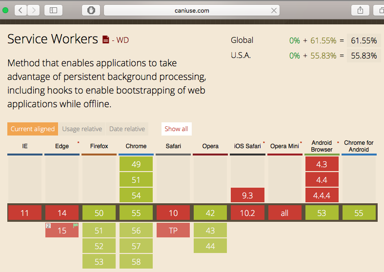

## Geoff Filippi

### Senior Architect

---

# [Dish Network](www.dish.com)

* Lots of wireless spectrum
* 13 M Satellite TV Customers
* [Sling TV](https://www.sling.com)

---

## Responsibilities

* Microservices
* Continuous Delivery

---

Formerly:

# [Oildex](www.oildex.com)

A cloud service company for oil and gas

* 2 years

---

## Oildex Projects

* Rewrite 10+-year-old apps
* Angular 1.5
 * New router
 * ES5
* Angular 2
 * Typescript
* Microservices

---

Formerly:

# [Time Warner Cable](www.timewarnercable.com)

* 12 years

---

## Experience

<i class="fa fa-phone"></i>

* Worked on streaming media (Voice over IP), 6 years
* 5 million phone customers

---

## Experience

<i class="fa fa-video-camera"></i>

* Worked on video and streaming video, 4 years

---

## Projects

[twctv.com](twctv.com)

* Video streaming website
 * backbone.js
* Video streaming Set-Top Box (STB) web application

---
---

# We will cover

* Mobile development
* Mobile web development
* Progressive Web Apps
 * Service Workers

---

## Mobile development

<i class="fa fa-mobile fa-5x" aria-hidden="true"></i>

is more important than 

##### desktop development 

<i class="fa fa-desktop" aria-hidden="true"></i>

--

## TODO - Mobile vs Desktop stats

* Device Sales
* Usage
* Revenue
* Site visits

---

##<i class="fa fa-apple" aria-hidden="true"></i> Mobile Native <i class="fa fa-android" aria-hidden="true"></i>

### vs. 

## <i class="fa fa-safari" aria-hidden="true"></i> Mobile Web Apps <i class="fa fa-chrome" aria-hidden="true"></i>

### vs. 

## Hybrid Mobile Apps

---

##<i class="fa fa-apple" aria-hidden="true"></i> Mobile Native <i class="fa fa-android" aria-hidden="true"></i>

* Target each native platform
 * iOS
 * Android
* Use native technologies
 * Swift/Objective-C
 * Android Java
* Two platforms, two apps

---

## Mobile Web Apps

* Target the mobile web platform
 * Browsers
* Use web technologies
 * HTML5, JavaScript, CSS
 * Web frameworks or libraries
   * Angular
   * React
* One platform, one app
* Reach the maximum number of users

---

## Mobile Hybrid Apps

* Target the native platforms
 * iOS
 * Android
* Use web technologies
 * HTML5, JavaScript, CSS
 * Web frameworks or libraries
   * Angular
   * React

---

## Mobile Hybrid Apps

* Use native shim technologies
 * Cordova (Phone Gap)
 * React Native
* Use Hybrid App frameworks
 * Ionic
 * NativeScript
* Two platforms, one app

---

## Pros and Cons

---

## Mobile Native

### <i class="fa fa-thumbs-up" aria-hidden="true"></i> Pros

* Best support for latest features
* Best hardware support
* Consistent look and feel
* Best offline support
* Monetization options

---

## Mobile Native

### <i class="fa fa-thumbs-down" aria-hidden="true"></i> Cons

* Platform-specific development technologies
* (At least) one team per platform
 * Specialized developers
* Platform-specific deployment
 * App Stores
 * Deployment speed depends on platform owner

---

## Mobile Native

### <i class="fa fa-thumbs-down" aria-hidden="true"></i> Cons

* Apps have to be installed before use
 * Higher friction than visiting a web app
* Depends on platform owner for discovery
* App store monetization costs

---

## Mobile Web App

### <i class="fa fa-thumbs-up" aria-hidden="true"></i> Pros

* Cross-platform web development and deployment technologies
* Continuous deployment
* One app (and team) can serve all users
* Discovery via google search
* Low friction to use
 * Install not required
* No platform App store costs

---

## Mobile Web App

### <i class="fa fa-thumbs-down" aria-hidden="true"></i> Cons

* Least direct hardware access
* Inconsistent look and feel
* Limited offline support
* Monetization is your problem

---

## Hybrid Mobile Web App

### <i class="fa fa-thumbs-up" aria-hidden="true"></i> Pros

* Cross-platform web development technologies
* One team can serve all mobile users
* Good support for latest features
* Good direct hardware access
* Consistent look and feel
* Good offline support
* Monetization options

---

## Hybrid Mobile Web App

### <i class="fa fa-thumbs-down" aria-hidden="true"></i> Cons

* Platform-specific deployment
 * App Stores
 * Deployment speed depends on platform owner
* Apps have to be installed before use
 * Higher friction than visiting a web app
* Depends on platform owner for discovery
* App store monetization costs

---

## When to Consider Mobile Native Development

* Development costs not an issue
 * Large/well-funded companies

---

## When to Consider Mobile Native Development

### Mobile-only companies

<br />
<i class="fa fa-snapchat-ghost" aria-hidden="true"></i> Snapchat 
<br />
<i class="fa fa-instagram" aria-hidden="true"></i> Instagram

---

## When to Consider Mobile Native Development

### Hardware

<br/>
<i class="fa fa-gamepad" aria-hidden="true"></i> Graphic-Intensive games <br/>
<i class="fa fa-play" aria-hidden="true"></i> Video streaming <br/>
<i class="fa fa-times" aria-hidden="true"></i> Offline <br/>
<i class="fa fa-compass" aria-hidden="true"></i> GPS <br/>

---

## When to Consider Mobile Native Development

App store monetization is key to business model

---

## When to Consider Hybrid Mobile Development

* Can help save development costs
 * One team can produce iOS and Android apps
* Keeps application consistent between platforms

---

## When to Consider Hybrid Mobile Development

* Moderate Native Platform Requirements
 * Supported by React Native or Cordova
 * Native features critical for app function
* Business model depends on App store monetization

---

## When to Consider Mobile Web App Development

* Limited development resources
* Business model does not depend on app store
* Business model depends on search results

---
---

# Mobile Web Development

* Mobile-first web development
* Responsive Web Design (RWD)
* Google search implications

---

## Mobile First

* Focus on the essential features

---

## [Responsive Web Design](https://alistapart.com/article/responsive-web-design)

> Not `m.` websites

- Example `m.yahoo.com`

---

## [Responsive Web Design](https://alistapart.com/article/responsive-web-design)

* Flexible, grid-based layout
* Flexible images and media
* Media queries

---

## [Google Ranks Mobile-Friendly Sites Higher](https://support.google.com/adsense/answer/6196932?hl=en)

---

Web Apps that are not mobile-friendly are not ready to become progressive web apps.

---

## Tools

* [Bootstrap](http://getbootstrap.com)
* [Material Design](https://material.io/guidelines/)
 * Various Implementations

---
---

# [Progressive Web Apps](https://developers.google.com/web/progressive-web-apps/)

---

## [Progressive Web Apps](https://developers.google.com/web/progressive-web-apps/)

> Reach of the web

Comprehensive User Experience Web App techniques for mobile

---

## Progressive Web Apps

* Reliable
* Fast
* Engaging 

---

## Progressive Web Apps

### Reliable

Use [Service workers](https://developers.google.com/web/fundamentals/getting-started/primers/service-workers) to handle network outages

---

## Progressive Web Apps

### Fast

* App shell
* Caching
* Lazy-loading

---

## Progressive Web Apps

### Engaging

* Installable
 * [Web App Manifest](https://developers.google.com/web/fundamentals/engage-and-retain/web-app-manifest/)
* Full screen
* [Push notifications](https://developers.google.com/web/fundamentals/engage-and-retain/push-notifications/)

---

## Service Workers

* Offline support for web apps
 * Useful for mobile devices

---

## Problem with Service Workers 

### on Mobile

* Only supported on Android

<i class="fa fa-android fa-5x"></i>

---


---

## Can I Use Service Workers

<a href="http://caniuse.com/#feat=serviceworkers">
    
</a>

---

# Service Worker Support

* Chrome
  * Since 44 (2014)
  * Android 4.1. Jelly Bean and Higher
* Firefox

---

## [Problems with App Cache](https://bugzilla.mozilla.org/show_bug.cgi?id=1237782#c34)

* Security
* Correctness
* Usability
* Not widely adopted
* Deprecated 
* Being removed from browsers

---

## Can I Use Appcache

<a href="http://caniuse.com/#feat=offline-apps">
    
</a>

---

## Options

* Keep ignoring offline support
* Use Service Worker only
 * No iOS support
* Use App Cache only
 * Supported everywhere, for now
* Use both Service Workers and App Cache
 * Compare effort to writing an iOS App

---

## Tools

* [Offline Plugin for webpack](https://github.com/NekR/offline-plugin)

---
---

# Service Worker

* Cache
* Network Proxy

---

## [How to use Service Worker](https://developers.google.com/web/fundamentals/getting-started/primers/service-workers)

### Register

```
if ('serviceWorker' in navigator) {
  window.addEventListener('load', function() {
    navigator.serviceWorker.register('/sw.js').then(function(registration) {
      // Registration was successful
      console.log('ServiceWorker registration successful with scope: ', registration.scope);
    }).catch(function(err) {
      // registration failed :(
      console.log('ServiceWorker registration failed: ', err);
    });
  });
}
```

---

## [Debugging Service Workers](https://developers.google.com/web/fundamentals/getting-started/codelabs/debugging-service-workers/)

---

# Questions?

--

## References

* [Webkit "not official" 5-year plan](https://trac.webkit.org/wiki/FiveYearPlanFall2015)
* [Offline First Slack](http://offlinefirst.org/chat/)
* [Offline First](http://offlinefirst.org)
* [Offline First](http://alistapart.com/article/offline-first)
* [Is Service Worker Ready?](https://jakearchibald.github.io/isserviceworkerready/)
* [Google Chrome Version History](https://en.wikipedia.org/wiki/Google_Chrome_version_history)
* [iPhone vs Android History Charts](http://www.theverge.com/2016/6/1/11836816/iphone-vs-android-history-charts)
* [Browser and Platform Market Share](https://www.w3counter.com/globalstats.php)
* [UpUp](https://github.com/TalAter/UpUp/blob/master/docs/README.md)
* [A Beginners Guide to Using the Application Cache](https://www.html5rocks.com/en/tutorials/appcache/beginner/)
* [FINHTML5 - Andrew Betts - Offline rules: Bleeding edge web standards at the Financial Times](https://www.youtube.com/watch?v=Ut4R4udJ4Gw)
* [Network connectivity: optional - Chrome Dev Summit 2013 (Jake Archibald)](https://www.youtube.com/watch?v=Z7sRMg0f5Hk)
* [gr2m/appcache-nanny](https://github.com/gr2m/appcache-nanny)
* [offline-plugin for webpack](https://github.com/NekR/offline-plugin)
* [Introduction to Progressive Web Apps](http://briebugconsulting.github.io/presentations/ng-meetup/2016/12/introduction-to-progress-web-apps)
* [Safari Client-Side Storage and Offline Applications Programming Guide - HTML5 Offline Application Cache](https://developer.apple.com/library/content/documentation/iPhone/Conceptual/SafariJSDatabaseGuide/OfflineApplicationCache/OfflineApplicationCache.html)
* [Ionic](https://ionicframework.com)
* [React Native](https://facebook.github.io/react-native/)
* [NativeScript](https://www.nativescript.org)
* [Cordova](https://cordova.apache.org)
* [Mobile First (2009)](http://www.lukew.com/ff/entry.asp?933)
* [Mobile First Book](http://www.lukew.com/resources/mobile_first.asp)
* [Mobile First Book - Safari](https://www.safaribooksonline.com/library/view/mobile-first/9780133052893/)
* [Responsive Web Design Book](https://abookapart.com/products/responsive-web-design)
* [Responsive Web Design - Safari](https://www.safaribooksonline.com/library/view/responsive-web-design/9780134188690/)
* [Angular Material](https://material.angular.io)
* [Progressive Web Apps](https://developers.google.com/web/progressive-web-apps/)
* [Can I Use - Notifications](http://caniuse.com/#feat=notifications)
* [Can I Use - Web App Manifest](http://caniuse.com/#feat=web-app-manifest)
* [Service Workers: an Introduction](https://developers.google.com/web/fundamentals/getting-started/primers/service-workers)
* [Don’t Wait for ServiceWorker: Adding Offline Support with One-Line](https://davidwalsh.name/dont-wait-serviceworker-adding-offline-support-oneline)
* [How Do We Get It Done, Now?](https://alistapart.com/column/how-do-we-get-it-done-now)
* [Offline Cookbook](https://jakearchibald.com/2014/offline-cookbook/)
* [GoogleChrome/samples/service-worker](https://github.com/GoogleChrome/samples/tree/gh-pages/service-worker)
* [googlecodelabs/debugging-service-workers](https://github.com/googlecodelabs/debugging-service-workers)
